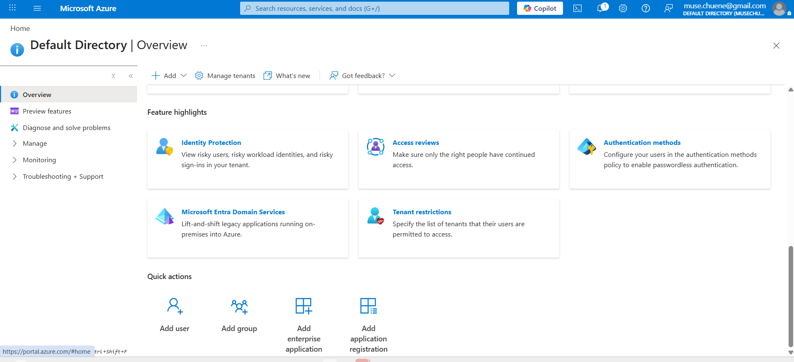
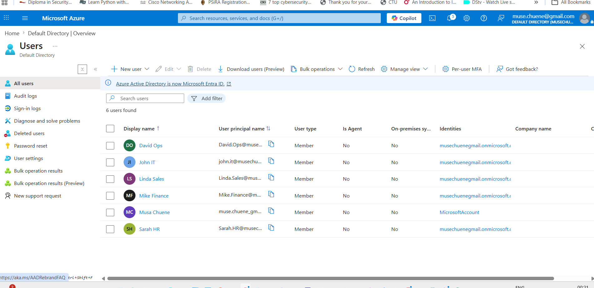
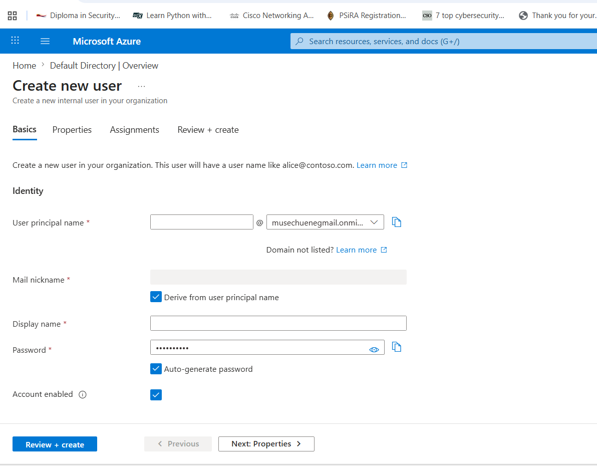
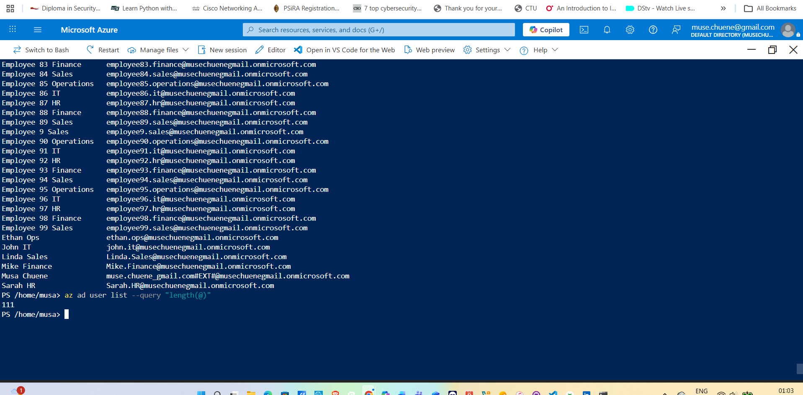
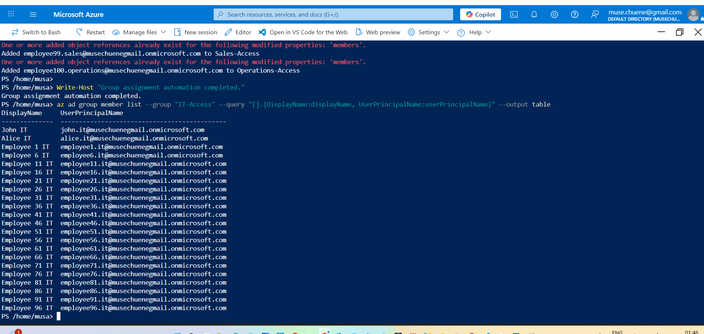

# ☁️ Azure Entra Service Desk Lab

## 📌 Project Overview

Azure Entra Service Desk Lab is a hands-on cloud identity and access management project designed to simulate real-world IT service desk and system administration operations within a 100-user enterprise environment.

This project demonstrates practical experience with:

- Microsoft Entra ID (Azure AD)
- User lifecycle management
- Role-Based Access Control (RBAC)
- PowerShell automation
- Azure CLI administration
- Security group management
- Automated onboarding and offboarding
- Identity and access administration workflows

The lab simulates a company environment where IT administrators manage users, departments, permissions, and access requests through automated administrative processes.

---

# 🎯 Project Objectives

The primary objective of this lab is to simulate enterprise-level service desk administration tasks including:

- Creating and managing users
- Assigning department-based access
- Managing security groups
- Automating onboarding workflows
- Automating offboarding processes
- Performing password and access management
- Managing cloud identities using Microsoft Entra ID

---

# 🏢 Simulated Company Environment

The environment simulates a company with approximately 100 employees distributed across multiple departments.

| Department | Simulated Users |
|---|---|
| IT | 10 |
| HR | 10 |
| Finance | 15 |
| Sales | 45 |
| Operations | 15 |
| Management | 5 |

---

# 🔐 Security Groups Configured

The following security groups were created to simulate enterprise RBAC access management:

- IT-Access
- HR-Access
- Finance-Access
- Sales-Access
- Operations-Access
- Management-Access
- All-Employees

---

# ⚙️ Features Implemented

## ✅ User Administration
- Manual user creation
- Bulk user provisioning
- User lifecycle management
- Department-based user organization

## ✅ Access Control
- RBAC security group implementation
- Group membership assignment
- Department-level access management

## ✅ PowerShell Automation
- Automated onboarding scripts
- Bulk user creation scripts
- Group assignment automation
- Offboarding automation

## ✅ Azure Administration
- Microsoft Entra ID management
- Azure Cloud Shell usage
- Azure CLI administration
- Identity and access management

---

# 🧰 Technologies Used

| Technology | Purpose |
|---|---|
| Microsoft Entra ID | Identity & Access Management |
| PowerShell | Administrative automation |
| Azure CLI | Cloud administration |
| Azure Portal | User & group management |
| GitHub | Version control & documentation |

---

# 📂 Project Structure

```text
Azure-Entra-Service-Desk-Lab
│
├── docs
│   ├── setup-guide.md
│   ├── service-desk-scenarios.md
│   └── user-onboarding-workflow.md
│
├── scripts
│   ├── create-users.ps1
│   ├── bulk-onboarding.ps1
│   ├── assign-groups.ps1
│   ├── reset-password.ps1
│   └── offboard-user.ps1
│
├── screenshots
│   ├── entra-id-overview.png
│   ├── security-groups-created.png
│   ├── manual-user-onboarding.png
│   ├── powershell-user-automation.png
│   └── automated-onboarding-results.png
│
├── README.md
├── LICENSE
└── .gitignore
```

---

# 🚀 PowerShell Automation Scripts

## Bulk User Creation
Automates onboarding of multiple users into Microsoft Entra ID.

## Group Assignment Automation
Automatically assigns users to department security groups.

## Offboarding Automation
Disables or removes users from groups during employee termination workflows.

## Password Reset Automation
Simulates service desk password reset operations.

---

# 🖥️ Screenshots

## Microsoft Entra ID Overview



---

## Manual User Onboarding



---

## Security Group Configuration



---

## PowerShell User Automation



---

## Automated Onboarding Results



---

# 📖 Skills Demonstrated

- Identity & Access Management (IAM)
- Azure Administration
- Microsoft Entra ID
- PowerShell Scripting
- RBAC Implementation
- User Lifecycle Management
- Cloud Administration
- Service Desk Operations
- IT Support Administration
- Administrative Automation

---

# 💼 Career Relevance

This project aligns with responsibilities commonly performed in:

- IT Support
- Service Desk
- Junior System Administration
- IAM Administration
- Cloud Administration
- SOC Analyst (L1)
- Azure Administration Roles

---

# ⚠️ Disclaimer

This project was created for educational and portfolio purposes only.  
No production tenant or sensitive organizational data was used.

---

# 👨‍💻 Author

## Musa Chuene

- LinkedIn: https://linkedin.com/in/musa-chuene-57a4461a8
- GitHub: https://github.com/musechuene-commits/Azure-Entra-Service-Desk-Lab

```